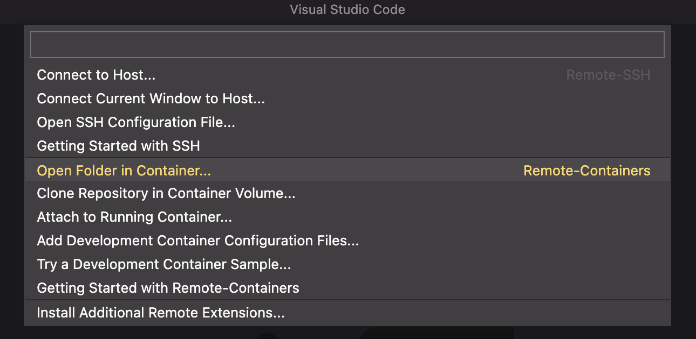

# Benutzerhandbuch

# Entwickeln im Devcontainer

<aside>
💡 **Anforderungen**
- Docker ist gestartet
- VSCode mit offiziellen Microsoft Extension [Remote Development](https://marketplace.visualstudio.com/items?itemName=ms-vscode-remote.vscode-remote-extensionpack)

</aside>

1. Öffnen Sie das Programm in VS Code
2. Klicken Sie unten rechts auf das Connection Icon und danach auf “Open Folder in Container”

1. Sobald der Container fertig gebuilded ist, können Sie das Programm gewöhnlich ausführen.

# Demovideo

[https://player.vimeo.com/video/756784921?h=e90d4d00ad&amp](https://player.vimeo.com/video/756784921?h=e90d4d00ad&amp)